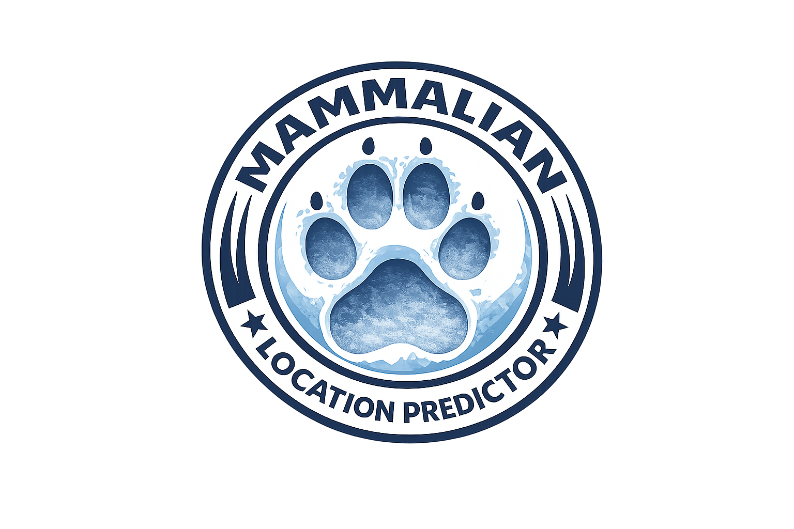

# Mammalian Location Predictor – UK Wildlife Reporting Dashboard

---

## Project Overview

The **Mammalian Location Predictor** is an AI-enhanced, public-facing data analytics
dashboard designed to explore **UK mammal reporting activity**. It transforms
large-scale citizen science records into accessible visual insights, revealing
**spatial and temporal patterns** in mammal observations and estimating **future
reporting activity** based on historical trends.

The project is intended for **non-technical audiences**, including students,
educators, conservation practitioners, and members of the public, while also
demonstrating professional data analytics practices.

> **Important note:**  
> All predictive outputs represent **estimated reporting activity**, not true
> mammal population size or confirmed animal presence.

---

## Fictional Client Brief

### Client: UK Nature Connect  
*(fictional public engagement and conservation organisation)*

UK Nature Connect aims to increase public understanding of wildlife across the
United Kingdom by making biodiversity data engaging and accessible. The
organisation works with educators, councils, and conservation groups to promote
data-driven storytelling around nature.

The client has access to the **National Mammal Atlas Project** dataset, which
contains millions of citizen science mammal observation records. Due to its
size, complexity, and technical format, this dataset is difficult for the
general public to explore meaningfully.

---

## Client Objectives

- Increase public engagement with UK mammals  
- Make complex biodiversity data intuitive and interactive  
- Encourage local exploration and awareness of wildlife  
- Support conservation interest through responsible data storytelling  

---

## Client Requirements

The client requested a **web-based interactive dashboard** that:

- Visualises mammal reporting data clearly and ethically  
- Allows exploration by location, time, and mammal group  
- Includes forward-looking analytical insights  
- Is suitable for non-technical users  

---

## Proposed Solution

To meet these objectives, this project delivers an **AI-enhanced interactive
dashboard** built with Python, Streamlit, and Plotly.

The application combines:
- Exploratory data analysis (EDA)
- Statistical summaries
- Interactive spatial and temporal visualisations
- A supervised machine learning model that estimates **future reporting activity**

This approach encourages curiosity and learning while avoiding claims about
actual animal population size.

---

## Dataset Source, Permissions, and Privacy

### Dataset Source

This project uses data derived from the **National Mammal Atlas Project**, a large-scale
citizen-science initiative that collects mammal observation records across the United Kingdom.

The dataset is intended for **research, education, and public engagement** and is commonly
used in ecological analysis and conservation contexts.

**Dataset citation:**  
National Mammal Atlas Project. *UK Mammal Observation Records*.  
Accessed for educational and non-commercial research use.
https://www.kaggle.com/datasets/scarfsman/data-resource-national-mammal-atlas-project
---

### Public Availability and Usage Rights

The dataset used in this project is sourced from a **publicly accessible biodiversity dataset**
made available for non-commercial research and educational purposes.

No restricted, proprietary, or confidential data is included in this repository.
The use of this dataset aligns with the project’s academic and educational objectives.

Where appropriate, the dataset has been **filtered and transformed** to ensure that only
information necessary for analysis and visualisation is retained.

---

### Data Anonymisation and Privacy Protection

To ensure ethical and responsible data handling:

- No personal information about observers or contributors is included  
- Exact, sensitive wildlife locations are **aggregated to area-level codes**
- Species-level data is grouped into **ecological mammal categories**
- Outputs represent **reporting activity**, not individual observer behaviour  

These measures reduce the risk of identifying individuals or enabling misuse of wildlife data.

---

## Dashboard Features

The dashboard includes:

- An interactive UK map showing dominant mammal groups by area  
- Time-series visualisations of reporting trends  
- Group-based comparisons using ecological mammal groupings  
- Clear explanatory text for non-technical users  
- A prediction page estimating **future reporting activity**  

Visualisations are designed to prioritise clarity, accessibility, and ethical
interpretation.

---

## Machine Learning Approach and Justification

### Objective

The machine learning component estimates the **expected number of future mammal
observation records** for selected mammal groups and geographic areas.

The model does **not** attempt to predict animal presence or population size.

### Features Used

- Area-level geographic identifiers  
- Temporal variables (year)  
- Mammal group classifications  
- Historical reporting volume  

### Model Choice

A **leakage-safe time-series regression approach** was selected to respect the
temporal structure of the data. This allows future periods to be predicted using
only historical information, avoiding unrealistic performance inflation.

The model choice prioritises:
- Interpretability  
- Robustness to uneven reporting patterns  
- Suitability for non-expert audiences  

---

### Model Evaluation

Model performance was evaluated using **Mean Absolute Error (MAE)** on a
held-out future time period. This evaluation strategy preserves the
temporal integrity of the dataset and avoids data leakage by ensuring
that future observations are not used to predict past values.

MAE was selected due to its interpretability for non-technical audiences,
as it expresses prediction error in the same units as the target variable
(number of records).

---

## Model Limitations

The predictive model is subject to several important limitations:

- Predictions reflect **human reporting behaviour**, not true mammal abundance  
- Observer effort varies by location and time  
- Some mammal groups are under-reported due to detectability  
- Early-year data contains lower coverage and was treated cautiously  
- Outputs are sensitive to historical reporting trends  

For these reasons, predictions are presented as **indicative trends**, not
deterministic outcomes.

---

## Responsible and Ethical Use of Data and AI (LO6)

This project follows responsible data and AI principles:

- Sensitive species data is aggregated at group and area level  
- No precise animal locations are exposed  
- Outputs clearly state that results represent reporting activity  
- Bias and uneven data coverage are explicitly discussed  

The project complies with ethical expectations for public biodiversity data and
aligns with UK data protection principles such as GDPR.

---

## Statistical Foundations

Core statistical concepts such as **mean, median, variance, standard deviation,
distributions, and hypothesis testing** are explained and applied in the
accompanying Jupyter Notebook.

Practical examples include:
- Mean and variance of reporting activity by area and mammal group  
- Distribution plots of yearly observation counts  
- A hypothesis test comparing reporting rates between mammal groups  

These analyses demonstrate how statistical principles support informed data
interpretation.

A hypothesis test comparing reporting rates between **bats and carnivores**
found a **statistically significant difference** (p < 0.05), indicating
that mammal groups exhibit meaningfully different reporting patterns.
This supports the use of mammal group aggregation in subsequent analysis
and modelling.

---

## Real-World Problem Analysis and Methodology

Wildlife reporting data presents a real-world analytics challenge because
**observation records do not directly represent animal populations**.

To address this:
- Data was aggregated by year to reduce noise  
- Species were grouped into ecological mammal groups  
- Descriptive statistics were applied before modelling  
- Limitations such as reporting bias and uneven coverage were evaluated  

This structured methodology supports transparent and defensible analysis.

---

## Use of AI Tools and Reflection

AI tools were used throughout the project to support:
- Code ideation and optimisation  
- Structuring analytical workflows  
- Drafting explanatory narratives  

Human judgement remained essential when:
- Selecting appropriate features  
- Interpreting model outputs  
- Framing predictions responsibly  

AI assistance enhanced productivity but did not replace analytical reasoning.

---

## Data Management Practices

Effective data management practices were applied, including:

- Clear separation of raw and cleaned datasets  
- Documented cleaning and validation steps  
- Version-controlled development using Git  
- Structured storage of outputs by project version  

These practices support reproducibility and transparency.

---

## Project Organisation and Research Design

The project follows best practices for independent research:

- Clear modular notebook structure  
- Defined research questions and methodologies  
- Justified analytical decisions  
- A Kanban-style project board to track progress  

Both the notebook and dashboard reflect a deliberate research design.

---

## Communication and Data Storytelling

Complex analytical outputs are communicated through:

- Interactive visualisations  
- Plain-language explanations  
- Clear labels, tooltips, and annotations  

The dashboard balances technical accuracy with accessibility, ensuring insights
are understandable to both technical and non-technical audiences.

---

## Application of Data Analytics in Ecology and Conservation

This project demonstrates how data analytics and AI can support ecological
domains by transforming large, complex datasets into actionable insights.

Analytics enables:
- Pattern discovery in biodiversity data  
- Public engagement through visual storytelling  
- Responsible exploration of environmental trends  

---

## Project Lifecycle and Future Development

The project is designed for ongoing development:

- New data can be integrated and models retrained  
- Model performance can be re-evaluated periodically  
- Additional features such as seasonal analysis may be added  

Future updates would be guided by user feedback and data availability.

---

## Learning Reflection and Professional Development

This project required adaptation to new tools, methodologies, and challenges,
including time-series modelling, interactive visualisation, and ethical AI
communication.

The experience strengthened end-to-end data analytics skills and reinforced the
importance of transparency and responsibility when applying AI in real-world
contexts.

## Reflection, Challenges, and Continuous Learning

### Reflection on Progress

Throughout this project, my understanding of data analytics evolved from focusing primarily on technical execution to considering **interpretation, ethics, and communication** as equally important components of a professional data product. Early stages of the project were centred on cleaning and exploring the dataset, while later stages required integrating statistical reasoning, machine learning, and user-focused storytelling into a single coherent application.

Building a public-facing dashboard reinforced the importance of explaining analytical outputs clearly and responsibly. In particular, reframing results as **reporting activity rather than true wildlife population measures** represented a key shift in analytical maturity and ethical awareness.

---

### Key Challenges and How They Were Addressed

One major challenge was dealing with **uneven data coverage across years and locations**, including incomplete recent-year data. This was addressed by identifying partial-year records, excluding them where appropriate, and clearly documenting these decisions in both the notebook and dashboard.

Another challenge involved balancing **model complexity with interpretability**. While more complex models were possible, a regression-based approach with engineered features was chosen to ensure transparency and ease of explanation for non-technical users. Model limitations were explicitly documented to prevent misinterpretation of predictions.

During development, performance and visual clarity issues arose when working with large datasets and layered visualisations. These were resolved through aggregation strategies, caching, and iterative refinement of visual outputs.

---

### Bug Fixes and Iterative Improvements

Several technical issues were encountered and resolved during development, including:
- Handling deprecated parameters in visualisation libraries by updating plotting approaches
- Resolving file path and module import errors during Streamlit app structuring
- Addressing warnings related to plotting libraries by refactoring code for future compatibility
- Improving robustness of date handling to accommodate multiple timestamp formats

Each issue was resolved through documentation review, experimentation, and refactoring, with fixes committed incrementally to version control to maintain a clear development history.

---

### Feedback and Adaptation

Feedback from peers and instructional guidance highlighted the importance of explicitly linking analytical outputs to learning outcomes and business context. This feedback informed improvements to documentation, clearer explanations of machine learning outputs, and more explicit justification of methodological choices. As a result, the final project demonstrates stronger alignment between analysis, storytelling, and assessment criteria.

---

### Development Roadmap and Next Steps

Based on this project experience, future development goals include:
- Expanding feature engineering to incorporate external data sources such as weather or habitat data
- Experimenting with alternative modelling techniques, including time-series forecasting methods
- Improving dashboard accessibility through enhanced colour contrast and user testing
- Exploring model monitoring and automated retraining pipelines
- Continuing professional development in ethical AI practices and explainable machine learning

This roadmap reflects a commitment to continuous learning and adaptation, building on the technical and analytical foundations established through this project.

---

## Project Planning and Delivery

A Kanban-style board was used to manage development:

### Completed
- Data loading, cleaning, and validation  
- Exploratory data analysis  
- Statistical documentation  
- Interactive visualisation  
- Client brief and solution definition  

### Ongoing Monitoring
- Reporting bias  
- Ethical considerations  
- Performance constraints  

---

## One-Sentence Summary

This project transforms UK mammal observation records into an AI-enhanced,
public-facing dashboard that visualises historical reporting trends and estimates
future reporting activity to engage users with wildlife data responsibly.

---

## Deployment Notes

- Deployed using Streamlit  
- Compatible with Heroku-supported Python runtime  
- Non-essential files excluded to manage slug size  

---

